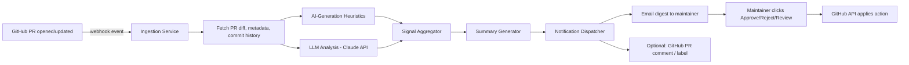

# AI-Assisted PR Triage System — Solution Design Document

## 1. Problem Statement

Open-source maintainers are being flooded with pull requests, many of which are AI-generated,
low-effort, or off-target. Reviewing every PR manually — reading the diff, understanding intent,
figuring out if it was written by a human who understands the codebase or a model that pattern-matched
its way to something plausible-looking — doesn't scale. The maintainer needs a fast, reliable way to
know, *before opening the code*, what a PR does, why it exists, and whether it's likely AI-generated —
so they can triage 100 PRs in minutes instead of hours.

## 2. Goals and Non-Goals

**Goals**
- Automatically analyze every incoming PR on a repo.
- Produce a short, trustworthy summary: what changed, why, and an AI-generation likelihood signal.
- Deliver that summary to the maintainer in a low-friction way.
- Let the maintainer act (approve / reject / request changes / ignore) with minimal effort.
- Work across many repos/languages without per-repo configuration.

**Non-goals (at least for v1)**
- Fully automating merge/reject decisions — the human stays in the loop.
- Perfect AI-detection (this is fundamentally a probabilistic signal, not a certainty).
- Deep static analysis / security scanning (can be a later add-on, not core).

## 3. Rethinking the Delivery Mechanism: Not a Browser Extension

Your instinct was "extension," but a browser extension is the wrong shape for this problem, and it's
worth being explicit about why:

- A browser extension only runs when the maintainer has a tab open and is actively browsing GitHub.
  It can't proactively watch for new PRs across many repos.
- It has no reliable way to trigger background jobs (LLM calls, email sending) — that needs a server.
- It doesn't work for anyone unless they install it individually per browser/device.

What you actually want is a **GitHub App (or webhook-driven bot)** — a small backend service that:
- Subscribes to `pull_request` webhook events (`opened`, `synchronize`, `reopened`) via the GitHub API.
- Runs entirely server-side, so it works the instant a PR lands, with no browser open.
- Can optionally *also* have a companion browser extension or dashboard later for a nicer in-browser
  view — but that's a UI layer on top, not the core mechanism.

This is the single most important architectural correction to make before building anything.

## 4. High-Level Architecture



**Components**

1. **Ingestion Service** — receives GitHub webhooks, verifies signatures, enqueues a job per PR.
2. **Diff/Context Fetcher** — pulls the PR diff, file list, commit messages, linked issue (if any),
   and repo context (README, contributing guide) via the GitHub REST/GraphQL API.
3. **AI-Generation Signal Engine** — combines cheap heuristics with an LLM judgment (see Section 5).
4. **Summarizer** — one LLM call that produces a structured summary (see Section 6).
5. **Notification Dispatcher** — formats and sends the email; optionally posts a PR comment/label too.
6. **Action Handler** — turns a click in the email (or a reply) into a GitHub API call (approve,
   request changes, close, or just label for later human review).

## 5. Detecting "AI-Written" — Realistic Expectations

Be upfront with yourself and the maintainer: **there is no perfect AI-detector.** Treat it as a
confidence signal, not a verdict, and combine multiple weak signals rather than relying on one model
call.

**Useful heuristic signals (cheap, no LLM needed):**
- Commit message style: generic/templated messages ("Fix issue", "Update file") vs. specific,
  contextual ones.
- Diff shape: sweeping, uniform changes across many unrelated files in one PR (common in
  auto-generated "improvement" PRs).
- Timing: PR opened seconds/minutes after the account starred/forked the repo, or many PRs from the
  same account in a short window.
- Account age, PR history, follower count, whether the account has any prior contribution to *this*
  project.
- Comment/code ratio: unusually verbose, textbook-style code comments explaining trivial code.
- Presence of boilerplate phrases models commonly produce ("This ensures optimal...", "Here's an
  improved version...") accidentally left in commit messages or comments.
- Whether the PR references a real, existing issue vs. inventing a problem to "fix."

**LLM-based signal (does the actual reasoning):**
- Feed the diff + commit messages + PR description to Claude with a structured prompt asking it to:
  - Assess likelihood of AI generation, with reasoning (not just a score).
  - Identify whether the change is coherent with the rest of the codebase's style/conventions.
  - Flag if the PR looks like a "drive-by" low-effort change (renaming variables, adding comments,
    trivial doc edits) — a very common low-quality PR pattern regardless of AI or not.

**Aggregation:** combine heuristic score + LLM score into one confidence band — e.g. *Low / Medium /
High likelihood of AI-assisted or low-effort authorship* — rather than a false-precision percentage.
Always show the reasoning, not just the label, so the maintainer can sanity-check it in one glance.

**Tie each band directly to a suggested action, not just a label.** This is the piece that actually
saves review time — the maintainer shouldn't have to re-derive "so what do I do with a Medium?" every
time:

| Tier | Meaning | Suggested Action |
|---|---|---|
| 🟢 High Confidence | Coherent intent, matches repo conventions/style, has tests, low AI-likelihood | Review & merge |
| 🟡 Needs Inspection | Mixed signals, high complexity, or partially off-topic | Manual check |
| 🔴 High AI/Spam Risk | Generic/templated, sweeping unrelated changes, no clear intent | One-click bulk close (still a deliberate click, not fully automatic) |

Two refinements worth keeping in mind if you use this three-tier framing:

- **Don't fully automate 🔴 into an auto-reject.** A misclassified genuine contributor closed
  automatically is a much worse failure than a maintainer spending an extra minute on a false
  positive. Keep a one-click *bulk* reject action so it's still fast, but still a human decision.
- **Security risk is a different axis from AI-likelihood, so don't fold it into 🔴 only.** A PR can be
  clearly human-written and still introduce a vulnerability, or be AI-generated and harmless. Surface
  a separate `⚠️ possible security concern` flag that can attach to any of the three tiers, rather
  than treating "spammy" and "unsafe" as the same signal.

## 6. Summary Generation (the core value)

For each PR, generate a structured summary — this is what actually saves the maintainer's time. Ask
the LLM to output something like:

```
Title: <one-line description of what this PR does>
Purpose: <why — e.g. bug fix, feature, refactor, dependency bump, doc change>
Scope: <files/modules touched, rough size (small/medium/large)>
Risk: <does it touch core logic, tests, CI config, security-sensitive code?>
AI-likelihood: <Low/Medium/High> — <one-sentence reasoning>
Quality signal: <does it include tests? does it follow repo conventions?>
Recommendation: <Merge-worthy / Needs human review / Likely low-effort, consider closing>
```

Keep this to ~150–200 words. The whole point is that the maintainer reads a paragraph, not a diff.

## 7. Notification Design — Rethink "100 Emails"

Sending 100 separate emails for 100 PRs will get the tool muted or filtered by Gmail within a day.
Better options, roughly in order of recommended priority:

1. **Digest email** — one email per day (or per N-hour batch) listing all new/updated PRs as a
   scannable table, each row linking to the full analysis. This is the sane default.
2. **Per-PR email, but only above a threshold** — e.g. only send an immediate email for PRs flagged
   High risk or High AI-likelihood; batch the rest into the daily digest.
3. **One-click actions in the email** — using signed action links (e.g.
   `https://yourapp.com/action?token=...&do=close`) that call the GitHub API server-side when clicked,
   so the maintainer never has to leave their inbox for routine cases.
4. **Also post a comment + label on the PR itself** (e.g. `ai-suspected`, `needs-review`,
   `low-effort`) — this helps even without email, and helps other contributors/bots downstream.

If the maintainer really wants one-email-per-PR, make it configurable — but default to digest mode.

## 8. Suggested Tech Stack

- **Webhook/backend:** Node.js (Probot framework, purpose-built for GitHub Apps) or Python (FastAPI +
  PyGithub). Probot is the most battle-tested option specifically for "GitHub App that reacts to PR
  events."
- **Queue/worker:** simple job queue (BullMQ, Celery, or even a lightweight DB-backed queue) so
  webhook spikes don't block processing.
- **LLM calls:** Claude API (Sonnet-class model is enough for this; batch multiple PRs per digest
  window to control cost).
- **Email:** a transactional email provider (Postmark, SendGrid, AWS SES) for reliable delivery.
- **Storage:** Postgres for PR metadata, summaries, and action history (needed for the one-click
  action links and to avoid re-analyzing unchanged PRs).
- **Auth:** GitHub App installation tokens (scoped per-repo, not a personal access token) — this is
  both the secure and the "right" way to act on behalf of a repo.

## 9. Security & Privacy Considerations

- Verify GitHub webhook signatures (HMAC) on every incoming request.
- Use GitHub App installation-scoped tokens, least-privilege permissions (PR read/write, contents
  read, don't request more than needed).
- Don't send full source code to the LLM if the repo is private and the maintainer hasn't explicitly
  opted in — surface this clearly in setup/onboarding.
- Signed, expiring tokens for the "click to approve" email links, single-use, tied to that specific
  PR + action.
- Rate-limit and dedupe: a PR getting force-pushed 10 times shouldn't trigger 10 LLM calls/emails —
  debounce on `synchronize` events.

## 10. Cost & Scaling Notes

- Cache the diff+context fetch; only re-run the LLM analysis when the PR's diff actually changes
  (compare against last-seen commit SHA).
- Batch cheap heuristics before spending an LLM call — if heuristics + repo context suggest an
  obviously trivial change (typo fix, single-line dependency bump), a shorter/cheaper prompt or
  smaller model can be used.
- Track cost per repo/installation if you ever offer this as a hosted service to multiple
  maintainers — this determines your pricing model if you take it beyond your own use.

## 11. MVP Roadmap

**Phase 1 (prove the core value):**
- GitHub App skeleton (Probot) that reacts to `pull_request: opened`.
- Fetch diff, run one Claude call for summary + AI-likelihood signal.
- Send a single digest email once a day listing all PRs with summaries.

**Phase 2:**
- Add heuristic pre-filtering to reduce LLM cost and improve accuracy.
- Add PR labels/comments in addition to email.
- Add one-click action links (approve/close/request-changes) from email.

**Phase 3:**
- Configurable notification cadence and thresholds per maintainer.
- Dashboard (web UI) as an alternative/complement to email.
- Multi-repo / multi-maintainer support if you want to offer this to others.

## 12. Comparison of Approaches Considered

| Approach | Works without browser open | Real-time on PR open | Effort to build | Notes |
|---|---|---|---|---|
| Browser extension | No | No | Medium | Wrong shape for this problem — dismissed |
| GitHub App + webhook + email digest | Yes | Yes | Medium | **Recommended** |
| GitHub Action (CI job) posting a PR comment | Yes | Yes (on PR events) | Low | Good complement, but no email; lives only on GitHub |
| Polling script (cron job checking PRs) | Yes | No (delayed) | Low | Simple but wasteful and laggy — only if webhooks aren't an option |

The recommended path is the GitHub App + webhook + email digest, optionally paired with a GitHub
Action for an in-PR comment as a lightweight complement — you get both the email convenience and a
visible signal for anyone browsing the PR directly on GitHub.
